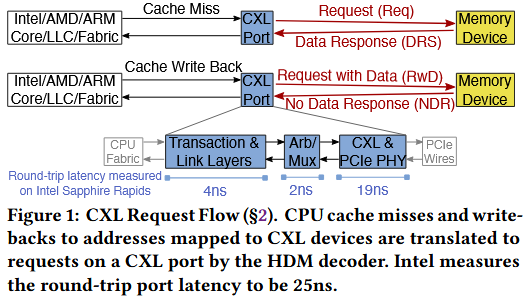

# CXL
CXL包含多种协议，包括ld/st内存语义（CXL.mem）和I/O语义（CXL.io）。CXL.mem将设备内存映射到系统地址空间，对于CXL内存地址的last-level cache(LLC) misses会转换为CXL端口上的请求，请求响应会返回未命中的cache lines。同样，LLC写回会转换为CXL数据写入。这两个操作都不涉及page faults或DMA。CXL内存通过管理程序页表和内存管理单元进行虚拟化，因此与虚拟化加速兼容。CXL.io协议用于设备发现和配置。  
CXL 1.1针对直接连接设备，CXL 2.0增加了基于交换机的池化功能，CXL 3.0标准化了无交换机池化和更高带宽。  
  

# NvLink  
